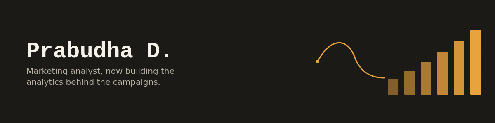

  

<h1 align="center">Hey, I'm Prabudha.</h1>
<h3 align="center">Eight years in marketing. Now teaching myself to prove things with numbers.</h3>

  <a href="mailto:harsh.prabu@gmail.com">Email</a> ·
  <a href="https://linkedin.com/in/prabudha-darabare/">LinkedIn</a> ·
  <a href="https://medium.com/@wordsandlogic">Medium</a> ·
  Based in Bengaluru

 

## The short version

I spent eight years writing the words that sell things: landing pages, SEO briefs, ad copy, brand voice guides, mostly for interior design and construction companies. I got very good at explaining why a campaign should work.

What I was never asked to do was prove it worked, with the actual numbers. So a while back I started fixing that gap myself: Python, SQL, Power BI, and the habit of asking "where's the data for that" before I trust a marketing claim, including my own past ones.

I'm not rebranding as someone I'm not. I still think in headlines and hooks. I've just added a second toolkit for testing whether those headlines are backed by anything real.

**Right now I'm looking for:** Marketing Analyst, Marketing Strategist, or Business Analyst roles in Bengaluru, where the content-and-numbers combination is actually the point, not a stretch.

 

## What I'm building right now

**Content Performance Intelligence**
A 650-record synthetic B2B SaaS content dataset, built to answer one question: what content should a company actually make more of, and why. Working through it in Python, Pandas, and Power BI.

 

## Projects I've shipped

**[Retail Pricing Intelligence](https://github.com/Prabudha-start/Retail-Pricing-Intelligence)**
Took messy retail pricing data, cleaned it, ran it through SQL and Python, and built an interactive Power BI dashboard to flag margin opportunities the raw spreadsheet was hiding.

**Revenue Leakage Analysis**
Traced where revenue quietly disappears across a sales funnel and ranked what to fix first. *(Link coming once the repo is public. Ping me if you want an early look.)*

 

## What I actually work with

  
  
  
  
  
  

Also still fluent in the marketing side: content strategy, SEO, HubSpot, Google Analytics, Google Ads, Meta Ads.

Currently working through the IBM Data Analyst Professional Certificate to fill in the gaps around visualization and structured problem-solving.

 

## I also write, separately from all this

Under **[Beyond the Resume](https://medium.com/@wordsandlogic/beyond-the-resume-6b045b48ccb6)**, I write honest, non-corporate essays about what actually happens inside a workplace: background verification calls, the parts of a career nobody puts on LinkedIn.

I also wrote **"Purity Is Not the Point,"** a research piece arguing against uniform purity standards in semiconductor manufacturing, published on LinkedIn Pulse. Different subject entirely, same instinct: don't accept the standard explanation without checking it.

 

## A little background, if you're curious

B.E. in Chemical Engineering from M.S. Ramaiah Institute of Technology. Currently finishing an M.A. in English through IGNOU, on the side. I like building things and writing about them in roughly equal measure, which is either a strength or a scheduling problem depending on the week.

 

  If you're hiring for something where content instincts and analytical rigor both matter, I'd like to hear about it. 
  <code>harsh.prabu@gmail.com</code>

  
  

Also fluent in: content strategy · SEO · HubSpot · Google Analytics · Meta & Google Ads

 

### `04` — Writing

I write reflective essays on workplace experience under **[Beyond the Resume](https://medium.com/@wordsandlogic/beyond-the-resume-6b045b48ccb6)** — where marketing craft meets honest career reflection.

 

`harsh.prabu@gmail.com` · [LinkedIn](https://linkedin.com/in/prabudha-darabare/) · [Medium](https://medium.com/@wordsandlogic)

